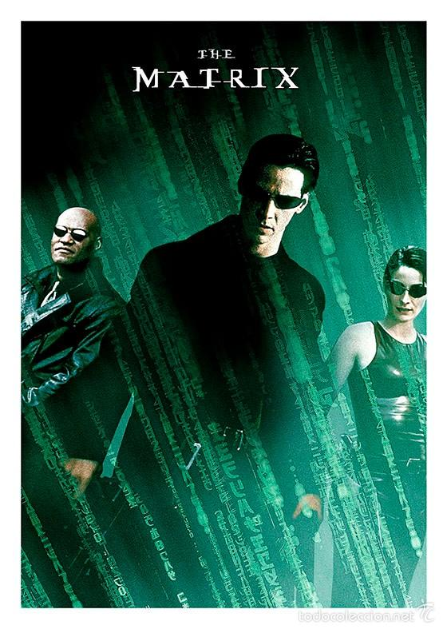
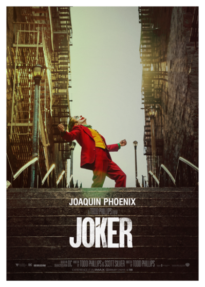
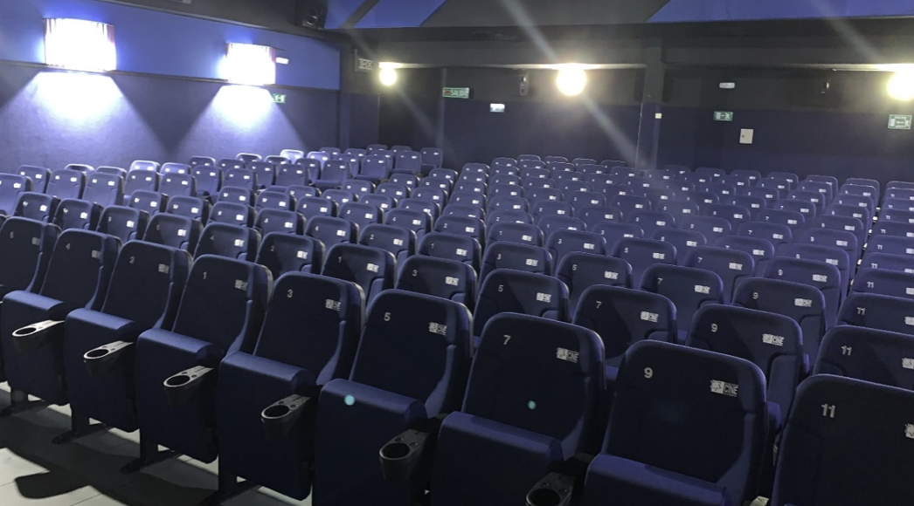

# Proyecto Cine

¡Bienvenido al proyecto **Cine**! Esta aplicación web desarrollada en **ASP.NET Core** y **MudBlazor** te permite gestionar una cartelera de películas, consultar sus detalles e incluso comprar entradas.

## Características principales

- Catálogo de películas con carteles y descripciones.
- Filtrado y búsqueda rápida por título.
- Visualización del horario por sala y día.
- Detalle de cada película con valoración de estrellas.
- Compra de entradas con selección de consumibles.
- Selección y reserva de asientos en las diferentes salas.

## Vista previa

<p align="center">
  
  
  
</p>

<p align="center">
  
</p>

## Requisitos

- **.NET 9 SDK**
- Un servidor MySQL para la base de datos

## Ejecución rápida

1. Restaura las dependencias y compila el proyecto:
   ```bash
   dotnet build
   ```
2. Ejecuta la aplicación:
   ```bash
   dotnet run --project Demo/Demo.csproj
   ```
3. Abre tu navegador en `https://localhost:5001` o la dirección que indique la consola.

## Estructura del repositorio

- `Demo/` &mdash; Proyecto principal de la aplicación.
- `Demo/Data` &mdash; Modelos de Entity Framework Core y contexto de base de datos.
- `Demo/Pages` &mdash; Componentes de la interfaz construidos con Razor y MudBlazor.
- `Demo/wwwroot/images` &mdash; Recursos gráficos utilizados en la web.

## Licencia

Este proyecto está bajo la licencia MIT. Consulta [LICENSE.txt](LICENSE.txt) para más información.

¡Esperamos que disfrutes del proyecto y que la experiencia te deje con ganas de visitar la cartelera una y otra vez!
